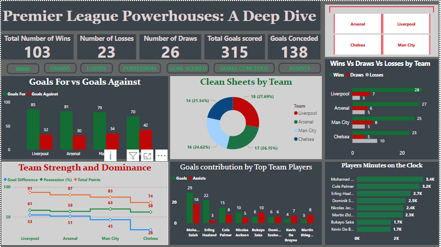

# PremierLeaguePowerhouses
An analysis about the Premier top 4(24/25 season
# 🏆 The Premier League Power House

An analytical exploration of the **top Premier League clubs (Liverpool, Manchester City, Arsenal, Chelsea) in the 2024/25 season**, covering:

- Full 38-match breakdown per club
- Home vs. away performance
- Goals & assists analysis
- Power BI interactive dashboards

## 📊 Features
- Clean, structured dataset for analysis.
- Python notebook with clear EDA and visualization.
- Power BI dashboard for interactive exploration.
- Useful for football analysts, fan pages, or predictive analysis projects.

## 🚀 Tech Stack
- Python (Pandas, Matplotlib, Seaborn)
- Power BI
- Excel (for initial structuring)

## 📸 Preview

## 💡 Future Plans
- Add defensive and xG analysis.
- Extend to other leagues or past seasons.
- Deploy with Streamlit for interactive web access.

## 🤝 Contributing
Contributions are welcome! Feel free to fork the repo, improve it, and submit a pull request.

---

