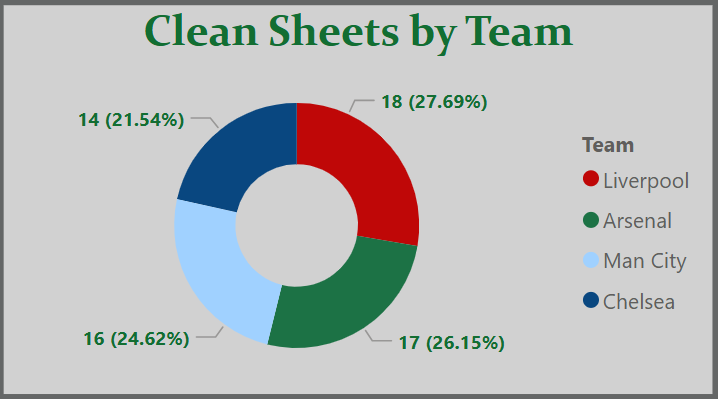
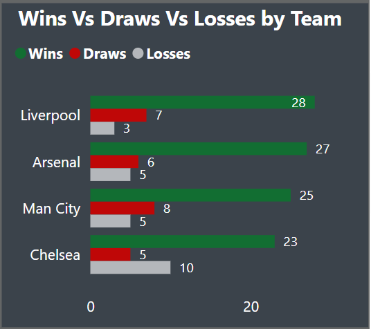
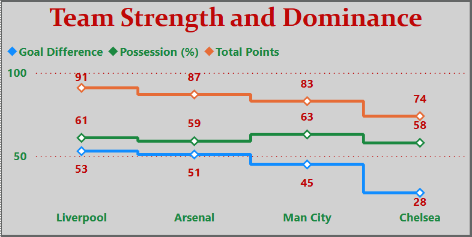
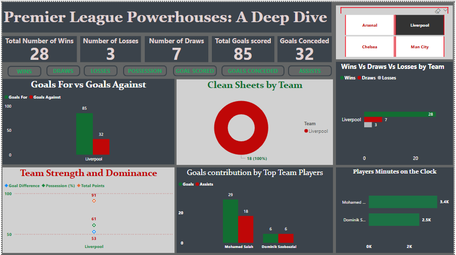

# 🏆 The Premier League Power House

An analytical breakdown of **Liverpool, Manchester City, Arsenal, and Chelsea** in the **2024/25 EPL season**, using **Power BI** and **Python** for clear, interactive insights.

This project explores:
- **Wins, draws, and losses**
- **Team strength and dominance**
- **Clean sheets analysis**
- **Interactive slicers for detailed filtering**

---

## 📂 Files Included

- `Clean.png` – **Clean sheets of the top 4 teams**.
- `EPLPowerhouse.png` – Full Power BI dashboard overview.
- `README.md` – Project documentation.
- `Slicer.png` – Interactive slicer for club and match filtering.
- `StrengthDominance.png` – Team strength and dominance comparison.
- `WinDrawsLose.png` – Win, draw, and loss summary for each team.

---

## 🛠️ Tools Used

- **Power BI** for interactive dashboards.
- **Python (Pandas, Matplotlib)** for data preparation.
- **Excel** for data structuring.

---

## 📸 Previews

### 🖼️ Power BI Dashboard

### 🖼️ Clean Sheets Analysis

### 🖼️ Wins, Draws, Losses

### 🖼️ Team Strength & Dominance

### 🖼️ Interactive Slicer View

---

## 🚀 Features
✅ 38-match season breakdown per club  
✅ Home vs. away analysis  
✅ Clean sheets comparison  
✅ Wins, draws, and losses tracking  
✅ Interactive slicers for deep dives  
✅ Clean, reusable dataset for your football analytics projects

---

## 📊Insights 

1. Liverpool were super strong in all areas.

2. Man city irrespective of their dominance in terms of possession weren't clinical up front and conceded a lot of goals.

3. Chelsea were behind in terms of scoring and conceded the most.

4. Arsenal were strong, conceded less amongst all but not so clinical upfront which made them come second on the log.

5. Most players with less minutes would have actually gotten more goal contributions if they had played same minutes with Mohammed Salah. 

6. Mohammed Salah really stood out in all areas despite playing as a winger and not a striker, having the most goals contribution. 

## NOTE: Data used for this Analysis may vary depending on source.

---

## 💡 Future Improvements
- Add xG (Expected Goals) comparison.
- Deploy a **Streamlit app** for web-based interaction.

---

## 🤝 Contributions
Feel free to:
- Fork and enhance visualizations.
- Add new seasons or additional clubs.
- Share insights and pull requests.

---

## 📬 Contact
For feedback or collaborations:
- **[Udohetop48@gmail.com]**
- **[@udoh_etop9488 @ X]**
- **[Etop Dominic on Facebook]**

---

⭐ **If you find this project insightful, kindly star the repository and share with fellow football analysts!**

---

